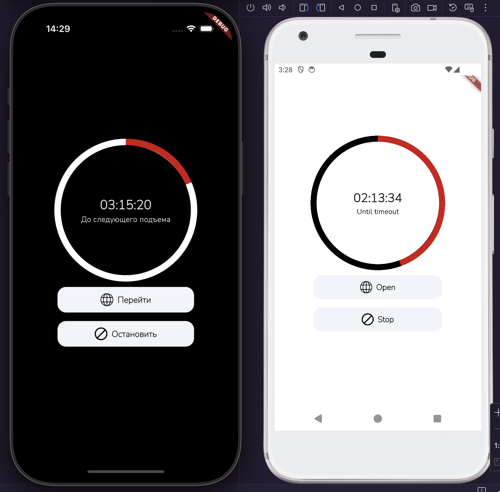

# HH Refresh

## **Developer**

[Paranid5](https://github.com/dinaraparanid)

## **About App**

**HH Refresh** is a mobile application written with Flutter
that schedules the reminder to promote your CV on hh.ru.
Once time is up, you will receive the notification.

## **Preview**

## **Stack**

<ul>
    <li>Flutter 3.29.0</li>
    <li>BLoC</li>
    <li>Get It</li>
    <li>Go Router</li>
    <li>Rx Shared Preferences</li>
    <li>Flutter Local Notifications</li>
    <li>Freezed + Json Annotations</li>
    <li>Intl + L10n</li>
    <li>Flutter Timezone</li>
    <li>Flutter Url Launcher</li>
    <li>Flutter Test</li>
</ul>
